# SDR Inteligente com Agendamento Automatizado

Case técnico de uma solução real de atendimento, qualificação de leads e agendamento, implantada em três escritórios de advocacia e uma agência de marketing.

> Este repositório documenta uma solução desenvolvida com n8n e utilizada em operações reais. O ambiente original não está mais ativo; credenciais, identificadores e dados comerciais foram removidos.

`n8n` · `JavaScript` · `OpenAI` · `Redis` · `Supabase` · `Google Calendar API` · `Z-API` · `ChatGuru`

## Resumo do case

| | |
|---|---|
| **Problema** | Atendimento manual, mensagens fragmentadas e consulta de agendas durante a conversa com o lead. |
| **Solução** | Agente integrado ao WhatsApp, CRM, Redis, Supabase e Google Calendar. |
| **Aplicação** | Três escritórios de advocacia e uma agência de marketing. |
| **Decisão central** | IA para interpretação e condução da conversa; JavaScript para regras críticas e previsíveis. |
| **Status** | Case documental de uma solução anteriormente utilizada. |

## Contexto de implantação

A solução foi desenvolvida e adaptada para quatro operações reais:

- três escritórios de advocacia;
- uma agência de marketing.

Cada operação possuía regras próprias de atendimento, qualificação de leads, profissionais, serviços e agendas.

A mesma arquitetura precisou ser adaptada para diferentes contextos comerciais, mantendo integrações com WhatsApp, CRM, Google Calendar, Redis e Supabase.

Mais do que um protótipo, o projeto foi utilizado como base operacional e precisou lidar com jornadas, agendas e regras distintas.

## Resultado da solução

A jornada principal automatizava a entrada do lead, consolidava mensagens, mantinha o contexto do atendimento, consultava agendas reais, evitava conflitos e registrava o agendamento sem intervenção manual durante o fluxo.

A solução também preservava o vínculo entre o evento do Google Calendar e o registro correspondente no Supabase, permitindo acompanhar cliente, serviço, profissional e status.

## Arquitetura

```text
CRM / WhatsApp
      │
      ▼
Webhook e normalização
      │
      ▼
Controle de usuário e consolidação de mensagens
      │
      ▼
Agente de IA
      │
      ├── Qualificação do lead
      ├── Consulta de disponibilidade
      ├── Criação de agendamento
      └── Atualização de contexto
      │
      ▼
Google Calendar + Supabase
      │
      ▼
Resposta sequencial pelo WhatsApp
```

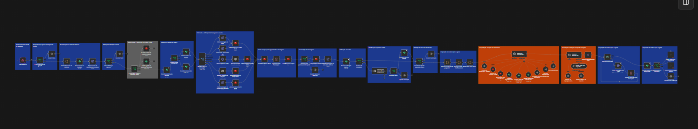

## Fluxos documentados

<details>
<summary><strong>Fluxo principal de atendimento</strong></summary>

### Entrada e normalização

O fluxo recebia texto, áudio e imagem. Cada formato era convertido para uma estrutura comum antes do processamento.

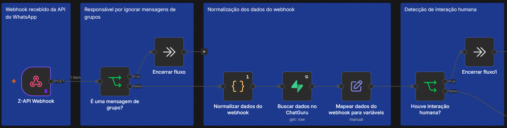

### Controle de usuário e mensagens

O sistema diferenciava primeiro contato, retomada e usuário conhecido.

Mensagens enviadas em sequência eram armazenadas temporariamente no Redis e consolidadas antes de chegar ao agente.

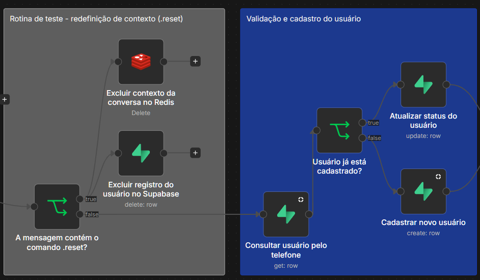

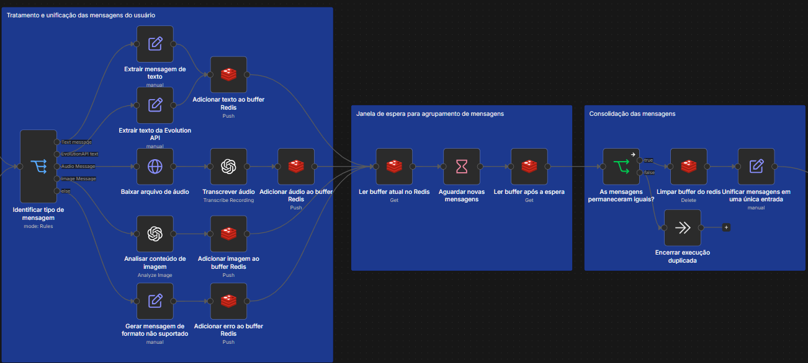

### Preparação e execução do agente

Antes da execução, o fluxo reunia mensagem consolidada, dados do contato, resumo, status e informações de qualificação.

O agente utilizava ferramentas internas para consultar horários, criar agendamentos e atualizar o contexto.

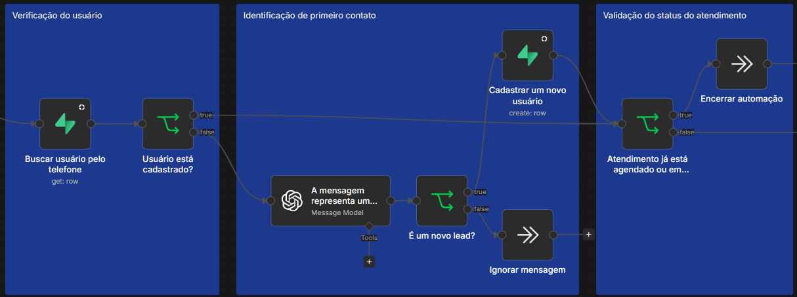

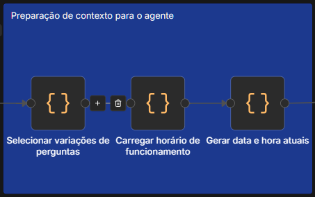

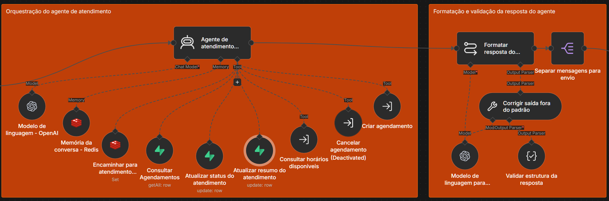

### Envio da resposta

A resposta era dividida em mensagens menores e enviada sequencialmente pelo WhatsApp.

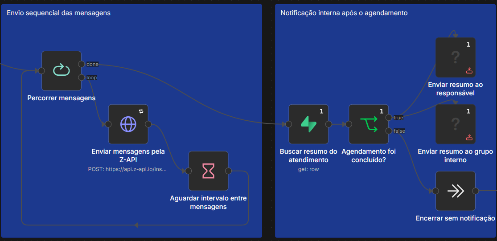

</details>

<details>
<summary><strong>Consulta de horários</strong></summary>

### Interpretação e validação

A IA normalizava a solicitação, mas não decidia quais horários estavam livres.

Um parser JavaScript convertia linguagem natural em uma estrutura previsível.

```text
Entrada: terça-feira depois das 15h
```

```json
{
  "data": "2026-07-28",
  "horaMin": "15:00"
}
```

O fluxo validava serviço, profissional, duração, funcionamento e restrições de horário.

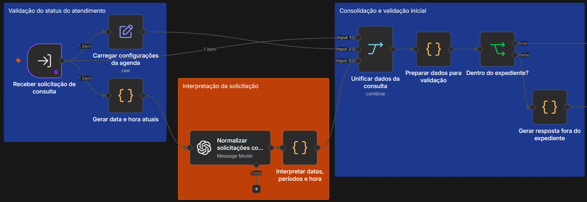

### Geração e filtragem

A disponibilidade era calculada considerando:

- duração do serviço;
- intervalo entre agendamentos;
- antecedência mínima;
- expediente;
- limite de dias futuros.

Eventos existentes no Google Calendar eram removidos antes da resposta ao agente.

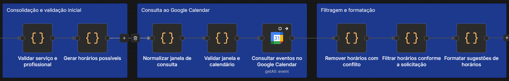

</details>

<details>
<summary><strong>Criação do agendamento</strong></summary>

O fluxo recebia cliente, telefone, serviço, profissional e horário selecionado.

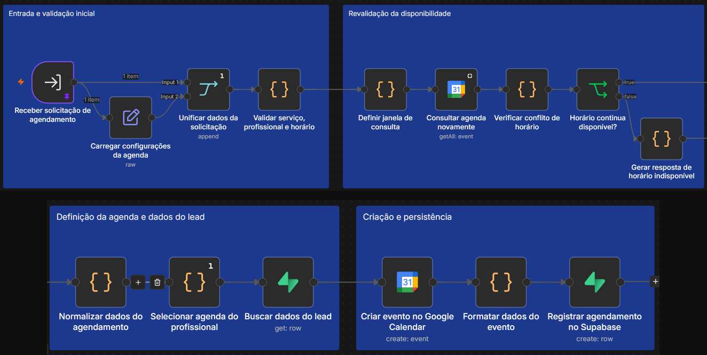

### Revalidação

A agenda era consultada novamente imediatamente antes da criação.

Caso o horário tivesse sido ocupado desde a primeira consulta, o evento não era criado.

### Persistência

Com o horário ainda disponível, o fluxo:

1. selecionava o calendário do profissional;
2. criava o evento no Google Calendar;
3. recuperava o identificador do evento;
4. registrava o agendamento no Supabase.

O registro mantinha cliente, serviço, profissional, início, término, identificador do evento e status.

</details>

<details>
<summary><strong>Cancelamento</strong></summary>

O fluxo foi desenvolvido e validado, mas não foi habilitado na jornada principal.

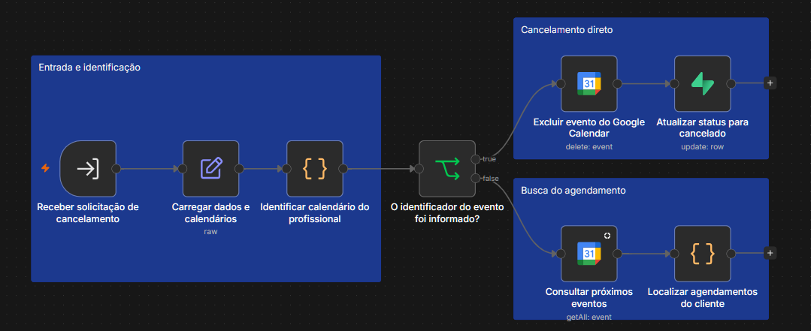

Quando o identificador do evento estava disponível, o compromisso era excluído do Google Calendar e o status era atualizado para `cancelado` no Supabase.

Sem o identificador, o fluxo consultava os próximos eventos e localizava os compromissos associados ao cliente.

A ativação completa exigiria uma estratégia de retomada da conversa ou um fluxo independente de pós-agendamento.

</details>

## Integração com CRM

O ChatGuru enviava os dados do lead por webhook.

O fluxo padronizava:

- nome;
- telefone;
- mensagem;
- responsável;
- campanha;
- origem;
- identificador do atendimento;
- link do chat.

Os dados eram tratados antes de serem persistidos ou encaminhados às próximas etapas.

## Códigos selecionados

Os arquivos abaixo foram extraídos de nodes JavaScript do n8n, sanitizados e organizados para leitura fora do workflow.

### Parser de agendamento

Interpreta datas relativas, dias da semana, datas numéricas ou por extenso, períodos e restrições de horário.

[Ver código do parser](docs/codigos/parser-de-agendamento.js)

### Disponibilidade e conflitos

Gera slots, respeita duração e antecedência, remove sobreposições do Google Calendar e aplica os filtros produzidos pelo parser.

[Ver código de disponibilidade](docs/codigos/disponibilidade-e-conflitos.js)

Regra de conflito:

```text
início do novo horário < fim do evento existente
E
fim do novo horário > início do evento existente
```

### Normalização do webhook

Limpa espaços, normaliza nomes e telefones, aplica fallbacks e extrai metadados recebidos do CRM.

[Ver código de normalização](docs/codigos/normalizacao-de-webhook.js)

## Principais decisões técnicas

### IA combinada com regras determinísticas

A IA era utilizada para lidar com ambiguidade linguística e conduzir a conversa.

Datas, duração, funcionamento, disponibilidade, conflitos e persistência eram tratados por código.

### Revalidação antes da reserva

A segunda consulta ao Google Calendar reduzia o risco de dois clientes reservarem o mesmo horário entre a sugestão e a confirmação.

### Redis para consolidação de mensagens

Mensagens fragmentadas eram agrupadas antes do processamento, evitando múltiplas respostas para uma mesma intenção.

### Persistência independente do calendário

O evento existia no Google Calendar e também no Supabase, permitindo histórico, status e relacionamento com o cliente.

### Subfluxos por responsabilidade

Consulta, criação e cancelamento foram separados do fluxo principal para reduzir acoplamento e facilitar manutenção.

## O que este case demonstra

- aplicação de uma solução em operações reais;
- adaptação da mesma arquitetura para diferentes clientes;
- integração com APIs, webhooks e serviços externos;
- agentes de IA com ferramentas;
- processamento de linguagem natural com limites determinísticos;
- regras de negócio em JavaScript;
- uso de Redis e Supabase;
- integração com Google Calendar;
- prevenção de conflitos de agendamento;
- modularização de workflows;
- documentação e análise crítica de uma solução existente.

## Limitações e possíveis evoluções

O ambiente original dependia de contas e serviços que não estão mais ativos, por isso o repositório não é apresentado como uma aplicação pronta para execução.

Em uma nova implementação:

- as regras de negócio seriam movidas para um backend dedicado;
- o n8n permaneceria principalmente como orquestrador;
- testes automatizados cobririam datas e disponibilidade;
- configurações de profissionais e serviços seriam centralizadas;
- logs e observabilidade seriam estruturados;
- cancelamento e reagendamento teriam uma jornada independente.

## Autor

**Gustavo Laudelino**
